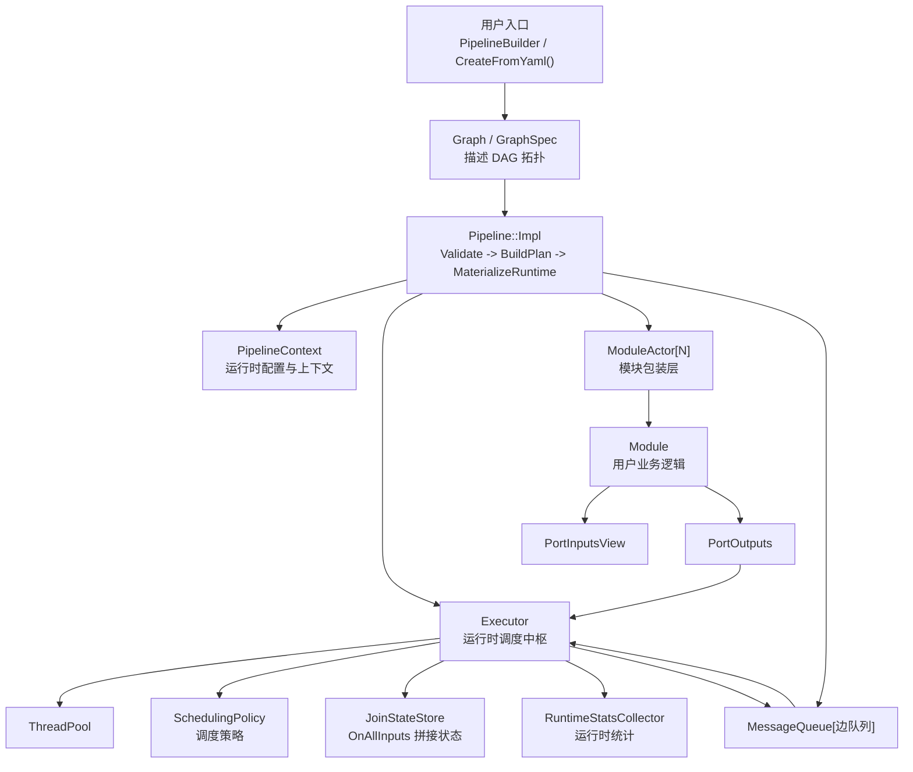
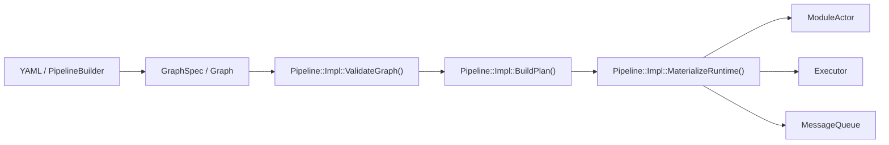
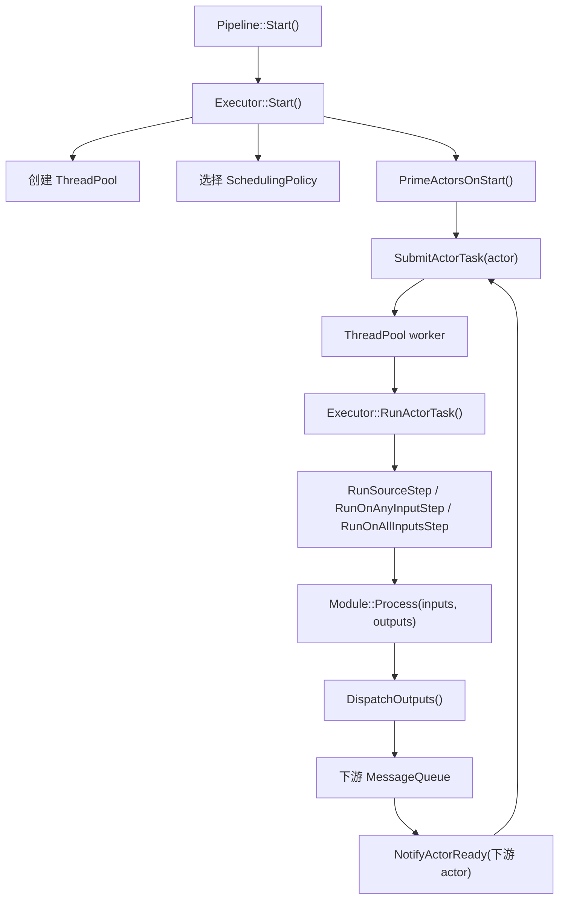
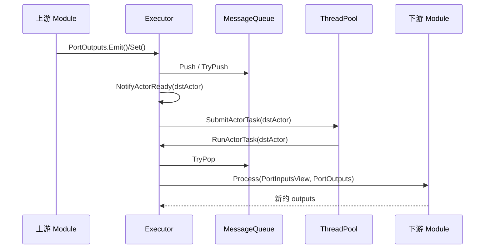
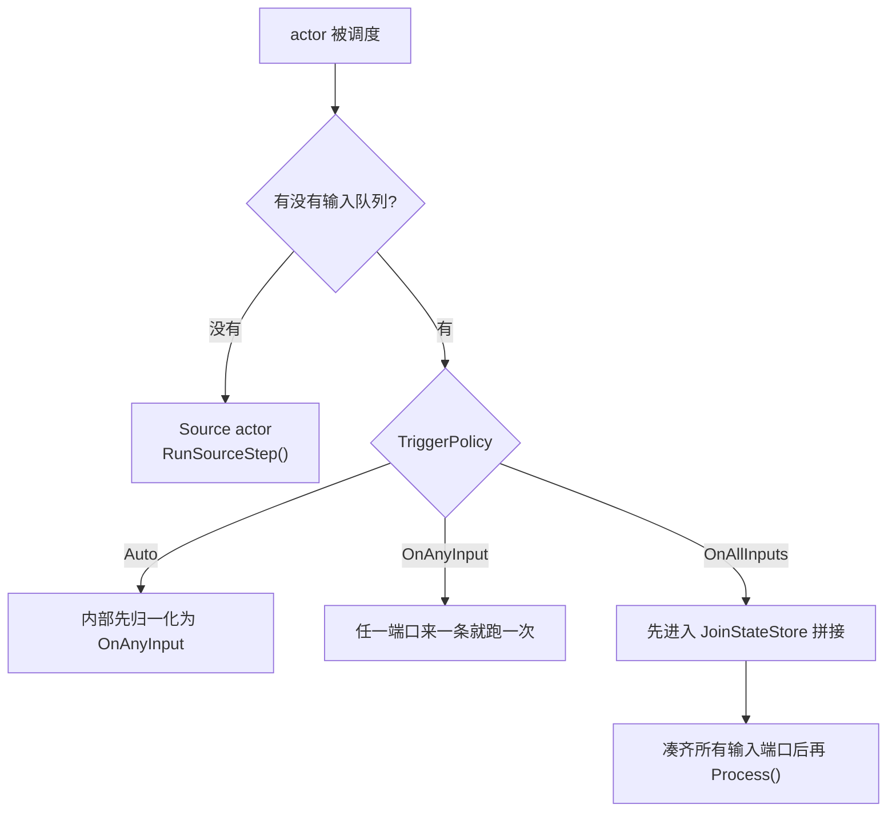

# NexusFlow 中文架构图

这份文档不是 roadmap，而是给“快速重新熟悉代码”用的。
目标很简单：先看清楚 **对象关系**、**数据怎么流**、**代码应该从哪开始读**。

## 1. 一句话理解

NexusFlow 当前的核心模型可以概括成一句话：

> `Pipeline` 持有一份 DAG 和一套共享运行时；`Executor` 负责调度模块；模块通过端口收发 `Message`。

也就是说：

- 模块不是“一模块一线程”
- 线程属于 `Executor -> ThreadPool`
- 模块只关心 `Process(inputs, outputs)`
- 调度、队列、join、统计都属于运行时

## 2. 总体架构图

## 3. 构建期视角

这一层回答的是：`pipeline` 是怎么被“搭起来”的。

### 构建阶段在做什么

1. `PipelineBuilder` 或 `CreateFromYaml()` 先生成图结构。
2. `ValidateGraph()` 检查图是否为空、是否有环、名字是否合法。
3. `BuildPlan()` 按拓扑顺序整理出节点和边。
4. `MaterializeRuntime()` 把“图”变成“运行时对象”：
   - 为每个模块准备 `ModuleActor`
   - 为每条边创建 `MessageQueue`
   - 把队列绑定到 `Executor`

### 对应代码

- [include/nexusflow/PipelineBuilder.hpp](/Users/yang/Code/Nexusflow/include/nexusflow/PipelineBuilder.hpp)
- [src/builder/PipelineBuilder.cpp](/Users/yang/Code/Nexusflow/src/builder/PipelineBuilder.cpp)
- [src/base/Graph.hpp](/Users/yang/Code/Nexusflow/src/base/Graph.hpp)
- [src/base/GraphUtils.hpp](/Users/yang/Code/Nexusflow/src/base/GraphUtils.hpp)
- [src/pipeline/impl/PipelineImpl.cpp](/Users/yang/Code/Nexusflow/src/pipeline/impl/PipelineImpl.cpp)

## 4. 运行期视角

这一层回答的是：`Start()` 之后谁在干活。

### 几个关键对象各自负责什么

#### `Pipeline`

- 生命周期入口
- 对外暴露 `Init/Start/Stop/DeInit`
- 对外暴露统计查询接口

#### `Pipeline::Impl`

- 真正持有运行时对象
- 负责把 DAG 物化成运行时
- 保存 actor 的拓扑顺序

#### `ModuleActor`

- 很薄的一层包装
- 把 `Module` 注册到 `Executor`
- 给模块注入 `Executor` 和 `PipelineContext`

#### `Executor`

- 当前运行时中最关键的类
- 管 actor 状态
- 管输入输出队列绑定
- 管任务提交到 `ThreadPool`
- 管消息分发

#### `SchedulingPolicy`

- 决定一次任务最多跑多少步
- 决定 `Auto` 最终按哪种触发语义执行
- 决定这一轮结束后要不要重新排队

#### `JoinStateStore`

- 只服务 `OnAllInputs`
- 按 join key 暂存不同输入端口的消息
- 拼齐一组输入后吐给模块
- 负责超时淘汰和上限淘汰

#### `RuntimeStatsCollector`

- 聚合 port / actor 的运行时统计
- 不参与调度决策
- 只负责记录与快照

## 5. 数据流怎么走

这个图最适合对着 `Executor.cpp` 一边看一边理解。

### 对模块作者来说

模块看到的其实很简单：

- 输入：`PortInputsView`
- 输出：`PortOutputs`
- 数据载体：`Message`

模块 **看不到** 也 **不需要关心**：

- 线程池
- 哪个 worker 在跑自己
- 下游队列具体怎么实现
- actor 是怎么被唤醒的

## 6. 触发模式怎么理解

### 当前语义

- `Auto`
  现在内部等价于 `OnAnyInput`
- `OnAnyInput`
  任一输入端口来消息，就触发一次 `Process()`
- `OnAllInputs`
  只有各输入端口凑齐同一组 join key，才会执行一次

## 7. 推荐阅读顺序

如果你想快速把代码重新捡起来，我建议按这个顺序读：

1. [include/nexusflow/Module.hpp](/Users/yang/Code/Nexusflow/include/nexusflow/Module.hpp)
   先看模块作者真正面对的 API。
2. [include/nexusflow/Ports.hpp](/Users/yang/Code/Nexusflow/include/nexusflow/Ports.hpp)
   看 `inputs/outputs` 到底长什么样。
3. [src/pipeline/Pipeline.cpp](/Users/yang/Code/Nexusflow/src/pipeline/Pipeline.cpp)
   看生命周期入口。
4. [src/pipeline/impl/PipelineImpl.cpp](/Users/yang/Code/Nexusflow/src/pipeline/impl/PipelineImpl.cpp)
   看 DAG 如何变成运行时对象。
5. [src/module/ModuleActor.cpp](/Users/yang/Code/Nexusflow/src/module/ModuleActor.cpp)
   看模块是怎么接进运行时的。
6. [src/executor/Executor.hpp](/Users/yang/Code/Nexusflow/src/executor/Executor.hpp)
   先记住对象关系。
7. [src/executor/Executor.cpp](/Users/yang/Code/Nexusflow/src/executor/Executor.cpp)
   再看真正的执行主流程。
8. [src/executor/SchedulingPolicy.hpp](/Users/yang/Code/Nexusflow/src/executor/SchedulingPolicy.hpp)
   看调度规则被抽到了哪里。
9. [src/executor/JoinStateStore.hpp](/Users/yang/Code/Nexusflow/src/executor/JoinStateStore.hpp)
   看 `OnAllInputs` 的拼接状态。
10. [src/executor/RuntimeStatsCollector.hpp](/Users/yang/Code/Nexusflow/src/executor/RuntimeStatsCollector.hpp)
   最后看统计层。

## 8. 现在这套架构的核心优点

- 模块代码很干净，业务逻辑和调度逻辑分离。
- 线程是 pipeline 级共享的，不是每个模块独占线程。
- `OnAnyInput` / `OnAllInputs` 的差异被放在运行时层，而不是塞进模块内部。
- builder 和 YAML 已经逐步走向同一条内部构建路径。

## 9. 现在最值得继续关注的点

- `Executor` 仍然是核心中枢，后面如果继续演进，最容易继续拆的是路由和 actor registry。
- `SchedulingPolicy` 现在还是内部策略，后面再决定要不要升格为公开配置。
- `JoinStateStore` 目前是“简单可读优先”，还不是最终性能形态。

